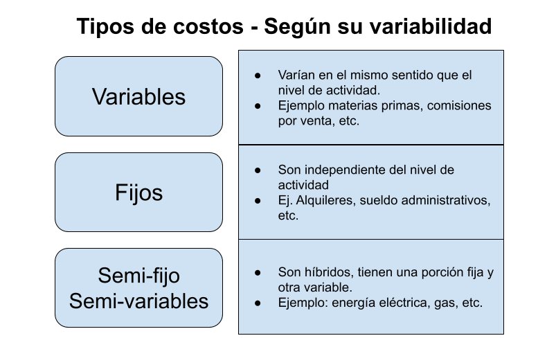
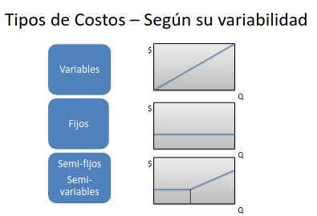
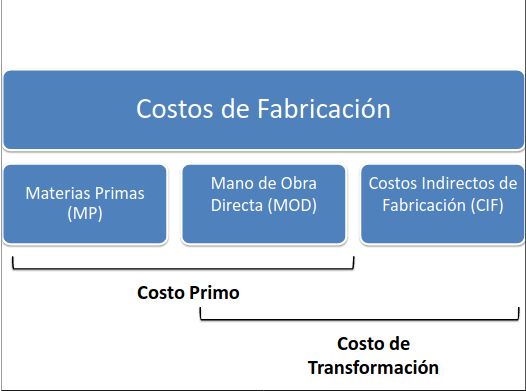
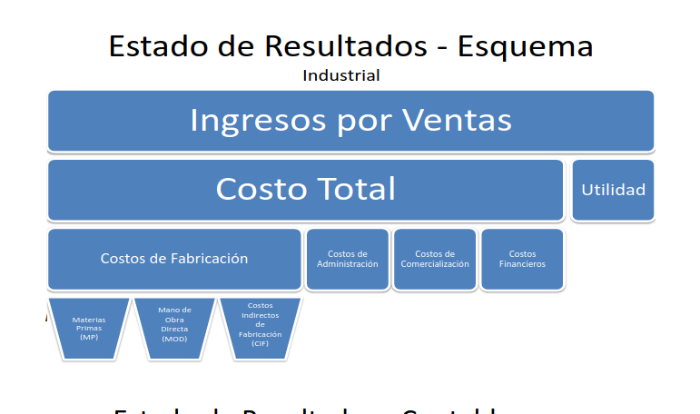

# Unidad 1

## Resumen de la unidad 1

Se definirá el concepto de costo y los objetivo de medirlos. La composición 
 típica y el análisis de la determinación del mismo y su reporte a través de un 
 estado de resultado.

### definición de costo.

Todos los elementos que forman parte del precio de venta, exceptuando la utilidad,
son costos.

### objetivo de la medición de costos.

Medir correctamente los costos le permite a una empresa alcanzar distintos objetivos:

- Para medir la eficiencia en las operaciones de producción se establecen diferentes
relaciones entre los costos totales (insumos) y las unidades producidas. De esta manera
se puede buscar el punto de equilibrio ideal entre el costo del producción y la cantidad producida.
- Valuar los inventarios de materias primas, productos en proceso y productos terminados.
- Conocer los costos es un información critica para definir los precios de venta aunque no debe
ser lo único a considerar.
- Determinar la utilidad de las operaciones de la empresa, para poder saber si los objetivos de 
rentabilidad que se hayan fijado fueron alcanzados.

### diferencia entre desembolso y costo

**Costo** es un **concepto económico**, y forma parte del reporte contable llamado Estado de resultado.
Los conceptos que aparecen en este reporte se rigen por el "criterio de lo devengado"

El **desembolso o erogación**, son **conceptos financieros** y forman parte del reporte contable llamado
flujo de caja (*"cash flow"*). Los conceptos incluidos en este reporte se rigen por el *"criterio de lo percibido"*, es decir, movimientos de fondos, ingreso o salidas de efectivo.

Otro caso distinto, por ejemplo, es la compra al contado de una maquina. Representa un desembolso, ya que hubo
un movimiento de fondo para pagar la compra, pero desde el punto de vista del costo impactara a través de la **amortización** de **bienes de uso**, a lo largo de varios ejercicios de la empresa.

#### aclaraciones sobre los conceptos:
- **Amortización**: tipo de costo que expresa la depreciación o perdida de valor que sufren los bienes de uso de la empresa: *maquinarias, rodados, edificios*.
Los objetivos del proceso contable de la amortización son:
    - Conseguir que al final de la vida útil del bien, se haya registrado como gasto de amortización el importe necesario para recuperar la inversión.
    - Permitir que los bienes aparezcan en el balance de la empresa por su valor real, llamado valor residual (valor de origen menos amortizaciones acumuladas)
    - Permitir un adecuado cálculo de la utilidad en el Estado de Resultado.

- **Bien de uso**:  Son aquellos bienes tangibles que se utilizan para desarrollar la actividad de la empresa; deben tener una vida útil estimada superior a un año y no estar destinada para la venta.

### clasificación de los costos

- ***Costos directos***: Son aquellos que se identifican claramente con una actividad, departamento o producto. Por ejemplo, las materias primas, los salarios del personal de producción, etc. Todos aquellos costos en lo que no existe duda entre la relación de ellos y el producto.
- ***Costos Indirectos***: Son aquellos que dependen de un cálculo, de un ratio o estimaciones para ser adjudicado a una actividad. Por ejemplo, el costo de administración de una planta industrial, es un costo indirecto, ya que no se puede identificar con claridad qué porción  de este costo corresponde a cada articulo producido.

##### De acuerdo al tiempo en que fueron calculados:
- ***Costos históricos***: Son los generados durante un determinado periodo, como los incurridos con los productos vendidos, que se encuentran en proceso o en inventario.
- ***Costos predeterminados***: Se estiman en base a series estadísticas de costos históricos o estudios de tiempos y movimientos y se incorporan a los presupuestos.

##### De acuerdo con el momento en que se cargan o enfrentan a los ingresos:
- ***Costos del periodo***: Aquellos que se identifican con un periodo de tiempo, por ejemplo un alquiler de unas oficinas. 
- ***Costo del producto***: Los costos de los productos que no generaron ingresos y permanecen inventariados.

##### De acuerdo al control que se tenga sobre la ocurrencia de un costo:
- ***Costos controlables***: Si bien todos los costos son controlables de alguna manera; ello depende básicamente de su nivel jerárquico desde donde se toma la decisión y representa el fundamento para diseñar sistema de control de costo por área de responsabilidad. Ejemplo, un gerente puede ejercer control sobre las comisiones de los vendedores pero no puede ejercer control sobre su propio salario.
- ***Costos no controlables***: Dependen de la autoridad o nivel en que se toma la decisión de adjudicación.

##### De acuerdo a la importancia para la toma de decisiones:
- ***Costos incrementales***: También llamados costos diferenciales o relevantes, se modifican dependiendo de la alternativa que se elija.
- ***Costos no incrementales***: Son costos que permanecen sin modificación, independientemente del curso de acción elegido. 

##### De acuerdo con el tipo de sacrificio en que se incurra:
- ***Costos desembolsables***: Son los que originan una salida de efectivo y que más tarde se convertirán en costos históricos.
- ***Costo de oportunidad***: Son aquellos provocados por seguir un curso de acción versus otro alternativo que hubiera generado ingresos. No implica una salida de efectivo sino la renuncia a un ingreso.

***Podemos dejar como reflexión final que los costos fijos están asociados a la capacidad instalada o la estructura de la empresa, mientras que los costos variables se relacionan con el nivel de actividad real.***

Tenemos otra clasificación que es un híbrido, son los costos que no son totalmente variables ni fijos. Por ejemplo, los servicios de luz, agua, gas, etcétera. Estos tienen la característica de tener un piso base y variar dependiendo del uso del mismo, y esto muchas veces puede estar asociado al producto final.

### Tipo de costos según variabilidad.

### Actividad. Clasificar los costos variables, fijos e híbridos

- Fijos: (Materia prima: plástico, master), sueldos de producción, alquiler, (depreciación de los bienes de uso: maquinaria, matrices, cadenas)
- Variables: desmoldante, guantes
- Híbridos : luz, gas, agua.

***Como un apartado interesante podemos decir que las empresas que tienen mayor cantidad de costos variables son más proclives a sobrevivir a crisis, ya que tienen mayor capacidad de adaptación.***

### Actividad. Identifique tres costos fijos e intente pasar a costo variable o híbrido.

- Contratación de personal.

### Características de los costos industriales.

La industria se caracteriza por desarrollar fases o procesos de producción para ciertos productos o lineas de productos uniformes.

Hay muchas industrias que utilizan este tipo de esquema, ejemplo: las alimenticias, farmacéutica, química, cemento, textil, etc.

La metodología utilizada por lo general es dividr la fábrica por fases de producción para asignar mejor los costos den los periodos establecidos.

### La estructura del costo industrial.

Las estructuras de costos son esquemas que muestran en forma desagregada los componentes principales del costo de un cierto productos o conjunto de productos. En el caso de una empresa del sector industrial, la estructura de costos incluye tipicamente los siguientes componentes:

1. **Costos de fabricación**: aquellos que forman parte del proceso de transformación de la materia prima en productos terminados.
    * Materias Primas **(MP)**: Es el material que se consumen en cantidad definida por cada unidad de productos. Se debe considerar la merma de la materia prima dentro del costo.
    * Mano de obra directa **(MOD)**: Se considera MOD a cualquier trabajo humano utilizado en la transformación o ensamble de la materia prima destinada al producto final. La suma de estos dos se le llama costo primo:
~~~
          MP + MOD = COSTO_PRIMO
~~~

* **Costos Indirectos de fabricación**: Se trata de costos que no tienen indicencia directa en el producto final, pero sin los cuales sería impisible la realización del mismo:
    * *Materiales indirectos*: suministros, repuestos, lubricantes, combustibles, entre otros.
    * *Trabajo asalariado*: mno de obra indirecta (MOI), tal como la supervisión, la dirección general, personal administrativo, etc.
    * *Otros costos*: energía eléctrica para iluminación, alquileres de planta, depreciación de bines de uso de la actividad fabril. Tasa de servicios.

  La suma de la mano de obra directa (MOD) y los costos indirectos de fabricación (CIF) dan como resultado el **costo de transformación**.

~~~
          MOD + CIF = COSTO DE TRANSFORMACIÓN  
~~~

2. **Costos de administración**: se originan en el área de administración general para la gestión del negocio. Incluye los salarios del personal, honostrarios, alquiler de oficinal, papeleria e insumos propios de la administación.
3. **Costos de comercialización**: Son lo que lleva acabo las áreas de venta y marketing. Ejemplo, sueldos y comisiones, fletes hasta el lugar de destino de la venta. Seguro por el transporte de la mercadería, gastos de promoción y publicidad.
4. **Costos financieros**: Aquellos vinculados al movimineto y la obtención de fondos para la empersa. Incluye intereses pagados por préstamos o giros en descubierto, comisiones bancarias, etcétera.

### Ejemplo: cálculo de incidencia de una variación de costos.
 Las estructuras de sotos pueden utilizarse, entre otra cosa para evaluar la indicencia de las variaciones de costos.

 Ejemplo de una estructura simple de costo:

 * MP: 40%
 * MOD: 25%
 * CIF: 35%

Si la materia prima (MP) de este insumo aumenta de precio un 10% que incidencia cuantivativa tendrá este aumento sobre el costo total del proveedor?.

Si vemos los calculos:
- MP  : incidencia actual-> 40% | variación -> 10%  | indicencia ajustada:  44%
- MOD : incidencia actual-> 25% | variación ->  0%  | indicencia ajustada:  25%
- CIF : incidencia actual-> 35% | variación ->  0%  | indicencia ajustada:  35%
- **Total:                   100%| ----------------- | indicencia ajustada: 104%**

Entonces resulta que un aumento del 10% en la materia prima tendrá un indicencia final del 4% sobre el costo de fabricación. Lo que debemos posteriormente es actualizar la incidencia que tiene cada componentes para analisis posteriores:

- Componente | Nueva incidencia cálculo | Nueva incidencia resultado |
- 
- MP         |        *(44/104)x100*      |            **42%**             |
- MOD        |        *(25/104)x100*      |            **24%**             |
- MP         |        *(35/104)x100*      |            **34%**             |
- **total**      |      *(104/104)x100*       |            **100%**            |

### Determinción del costo de ventas

Es importante remarcar que el costo de ventas no es necesariamente equivalente al costo de fabricación del periodo analizado. Por lo tanto debe seguirse un procedimineto específico para el cálculo del costo de ventas del periodo. El costo de las materias primas (MP) consumidas en la producción, se suma la existencia inicial de MP, las compras del período, y se resta la existencia final de MP. Luego, a este importe de MP consumidas se le suma al costo de la MOD y los CIF del período, para obtener el costo de fabricación total. Este costo debe ser ajustado porque no todos los productos llegan a ser terminados en el mismo período, y hay existencias de productos en procesos que provienen de un período anterior. Luego de este ajuste, se obtiene el costo de fabricación de los productos terminados durante el período analizado.

###Contabilidad de costos - Industrial.
---
- Mas   Compra de materia prima
- Menos Inventario final de Materia Prima
---
**IGUAL  Materia Prima Consumida**
- Mas   Mano de Obra directa (MOD)
- Mas   Costos indirectos de Fabricación (CIF)
---
**IGUAL  Costos de fabricación** (productos terminados y no terminados)
- Mas   Inventario inicial de Productos en Proceso
- Menos Inventario final de Productos en Proceso
---
**IGUAL  Costos de fabricación** (solo productos terminados)
- Mas   Inventario inicial de productos terminados
- Menos Inventario final de productos terminados
---
**IGUAL  COSTO DE VENTAS**

### Estado de Resultados.

Es un reporte que indentifica los ingresos y costos de la empresa y permite calcular la utilidad de ciertos periodos. La determinación de los costos de la empresa ayuda a confesionar el Estado de Resultado del período analizado, y así llegar al resultado economico de la actividad de la empresa.

- OPERACION   |   Ventas Netas
- 
- ***Menos***       |  *Costo de ventas*
- IGUAL       |  **utilidad bruta**
- ***Menos***       |  *Costo de administración*
- ***Menos***       |  *Costo de comercialización*
- IGUAL       |  **utilidad operativa**
- MAS         |  *Ingresos no operativos*
- ***Menos***       |  *Costos financieros*
- MENOS       |  *Impuestos*
- MENOS       |  *Otros costos no operativos*
---
- ***IGUAL***       |  ***utilidad neta***

